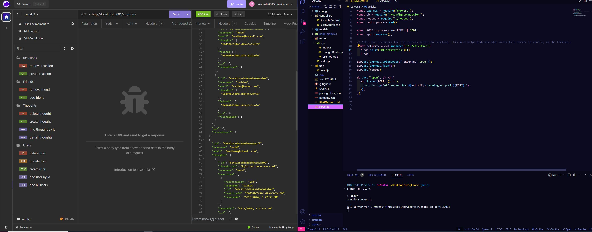

# noSQLzone

## Description
This is an application demonstrating how to create and use an API to interact with a mongodb database with a mongoose ODM.  The application will simulate a social networking web app with users,friends,thoughts,and reactions.  

## Installation
Install node.js and then npm install express and mongoose

## Technologies
Javascript
nodeJS
npm:
express
mongoose

## Usage
The User needs to enter node server.js to run the application in the terminal. Once connected to the server the database can be seeded by opening the terminal in the seed.js file location and entering node seed.js, routes can be tested using Insomnia.

## license
See repository for licensing information 

## Credits
Collaborators include: Alic Madd and Katriel Chiu
resources used: MDN, W3 schools, google search

## links

github repo:
https://github.com/RTAKA808/noSQLzone

screenshot:

demo link:
https://drive.google.com/file/d/1tQLWPWtzCvP13wTmj6nJYPminh59PVbq/view?usp=sharing